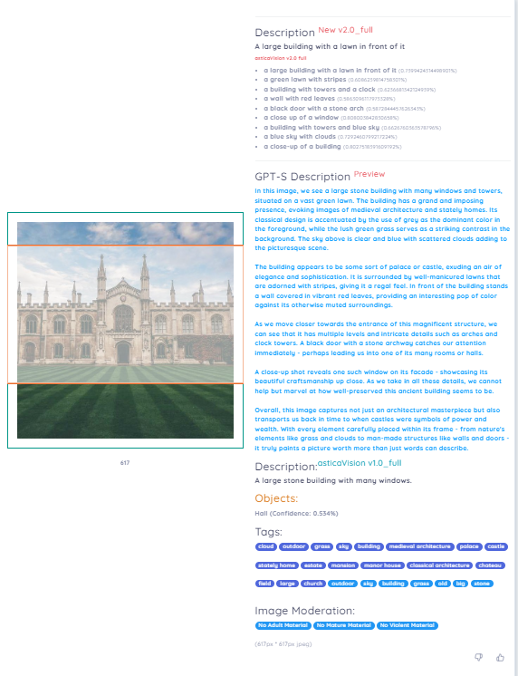

.. post:: Nov 1, 2023
   :tags: fototecas, catalogación, inteligencia artificial
   :category: Tendencias en Bibliotecas
   :author: Luis Enrique Lescano Borrego
   :exclude:

   En la era digital, las fototecas se erigen como guardianas de momentos capturados en el tiempo, desde retratos históricos hasta instantáneas contemporáneas. El proceso de descripción y catalogación de estas imágenes ha sido históricamente laborioso, demandando tiempo y extensas investigaciones. 

.. meta::
   :keywords: Fototecas, descripción de fotos, Inteligencia Artificial, accesibilidad, tecnología, bibliotecas
   :description: Descubre cómo la Inteligencia Artificial está transformando la forma en que las fototecas gestionan y describen sus valiosas colecciones de imágenes en la era digital. Explora los avances tecnológicos, los beneficios y las consideraciones éticas en este emocionante campo.

*********************************************************
Fototecas del Siglo XXI: descripción de fotos con IA
*********************************************************

En la era digital, las fototecas se erigen como guardianas de momentos capturados en el tiempo, desde retratos históricos hasta instantáneas contemporáneas. El proceso de descripción y catalogación de estas imágenes ha sido históricamente laborioso, demandando tiempo y extensas investigaciones. Sin embargo, en la actualidad, la tecnología puede transformar este proceso. En esta publicación, exploraremos cómo la **Inteligencia Artificial (IA)**, específicamente diseñada para describir fotos y principalmente utilizada por cuestiones de accesibilidad, es una puerta abierta a cambiar la manera en que los bibliotecarios enriquecen sus valiosas colecciones de imágenes.

===================================
📸 La Evolución de las Fototecas
===================================

Las fototecas han recorrido un corto pero apasionante camino de evolución en las últimas décadas, en comparación con las bibliotecas. Desde sus inicios como archivos físicos de fotografías impresas, daguerrotipos y placas secas, hasta la actualidad, caracterizada por el almacenamiento digital y el acceso en línea, su transformación ha sido notable. Las fototecas se han adaptado a las tecnologías emergentes para la captura de imágenes, incorporando sistemas de gestión de imágenes, digitalizando colecciones históricas y empleando herramientas de descripción avanzadas. Esta evolución no solo ha mejorado la conservación y accesibilidad de las imágenes, sino que también ha facilitado una colaboración y compartición más amplias a nivel global. Las fototecas del siglo XXI son espacios donde la tradición y la innovación convergen, brindando un acceso más amplio y enriquecedor a un vasto patrimonio visual que abarca desde el pasado hasta el presente.

.. admonition:: Listado de Fototecas
    :class: hint 
    
    #. `Fototeca del Instituto del Patrimonio Cultural de España <http://catalogos.mecd.es/IPCE/cgi-ipce/ipcefototeca/O13293/ID3e51c4b6?ACC=101>`_
    
    #. `Archivo fotográfico de Nueva Zelanda <https://natlib.govt.nz/collections/a-z/photographic-archive>`_ 

    #. `Fototeca Nacional INAH <https://mediateca.inah.gob.mx/repositorio/islandora/object/fototeca%3A62>`_ 

    #. `Fototeca del Tecnológico de Monterrey <https://repositorio.tec.mx/handle/11285/636548>`_ 

    #. `SGI Fototeca Laboratorio del Arte <https://citius.us.es/fototeca/index.php>`_ 

=====================================
🖼️📝 Descripción Avanzada de Fotos
=====================================

Uno de los avances más emocionantes es la capacidad de la IA específica para comprender el contenido de las fotos de una manera sorprendente. Estas IA pueden identificar objetos, personas, lugares y más en una imagen, generando descripciones detalladas y precisas. Los bibliotecarios pueden aprovechar esta tecnología para enriquecer sus colecciones con datos más completos y contextualmente ricos. En estos casos, se ha producido un gran avance en la adaptación de tecnologías para que los navegadores y otros sistemas puedan leer imágenes y abordar problemas de accesibilidad visual.

En este contexto, se destaca el uso de analizadores de imágenes con IA que permiten realizar descripciones detalladas de fotos. Por ejemplo, algunas empresas han desarrollado modelos capaces de identificar el contenido de una imagen, detectar los objetos presentes, crear descripciones coherentes con la imagen analizada utilizando GPT-S, extraer las etiquetas principales de la imagen y determinar si el contenido es violento o para adultos. He realizado un ejemplo con el `modelo proporcionado por la empresa ASTICA <https://www.astica.org/vision/describe/>`_  en el que analicé una foto de un edificio, y es sorprendente la claridad con la que detecta los objetos y construye una descripción coherente con la imagen analizada. Las etiquetas generadas son más precisas que las palabras clave tradicionales.

       Captura de pantalla del Modelo proporcionado por la empresa ASTICA

=================================================
🤖 Beneficios de la IA para Fototecas:
=================================================

* **Eficiencia:** La IA agiliza el proceso de catalogación y descripción de fotos, lo que permite a los bibliotecarios gestionar grandes colecciones de manera más efectiva y con mayor rapidez.

* **Precisión:** La IA puede proporcionar descripciones precisas y etiquetas relevantes, enriqueciendo la información asociada con cada imagen, lo que mejora la calidad de los registros.

* **Accesibilidad:** Las descripciones detalladas y etiquetas inteligentes hacen que las fotos sean más fáciles de encontrar y utilizar para una variedad de propósitos, lo que promueve la accesibilidad y usabilidad.

* **Desafíos y Consideraciones Éticas:** Es de suma importancia abordar cuestiones éticas al utilizar IA en el ámbito de las fototecas, especialmente en lo que respecta a la privacidad y el sesgo algorítmico. Garantizar que las aplicaciones de IA sean éticas y respetuosas con los derechos de las personas es esencial para su implementación exitosa y responsable.

 Si deseas saber más sobre este apasionante tema y aprender cómo vincular la IA en tu trabajo bibliotecario diario, te invitamos a visitar nuestro :doc:`curso "Inteligencia Artificial en Biblitoecas" </cursos/ia-biblio>` . ¡Es una oportunidad única para profundizar en estas tecnologías y explorar su aplicación en tu entorno profesional!